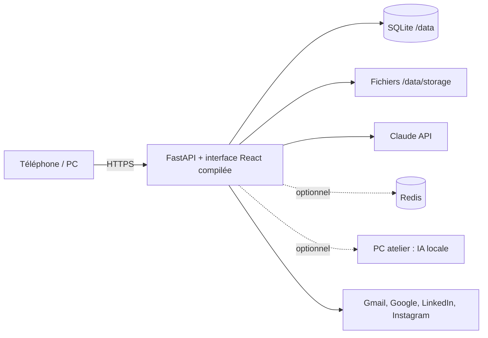

# Architecture

Application mono-propriétaire (UniC Plaquiste). Un seul conteneur sert l'API et l'interface.

## Couches (backend/app)

| Couche | Fichiers | Rôle |
|---|---|---|
| Entrée HTTP | `main.py`, `api.py`, `api_reseaux.py`, `api_voice.py`, `api_website.py` | Routes, garde d'accès, CORS, en-têtes, erreurs |
| Orchestration IA | `orchestrator.py`, `agent.py`, `ai.py`, `trust.py` | Conversation, outils de l'IA, chaîne de fournisseurs, contenu de tiers traité comme donnée |
| Métier | `calc.py`, `metier.py`, `pricecheck.py`, `services.py`, `pdfs.py` | Calculs visibles, prix, devis/factures, PDF |
| Données | `models.py`, `database.py` | SQLAlchemy, ajout de colonnes/index au démarrage |
| Connecteurs | `connectors.py`, `mailbox.py`, `google_business.py`, `linkedin.py`, `instagram.py` | Services externes |
| Auto-surveillance | `selfcare.py`, `repair.py`, `agents.py` | Incidents, contrôle quotidien, propositions de correction (PR), agents planifiés |

Frontend : `frontend/src` (React, Vite, TypeScript). Pages principales dans `App.tsx`, atelier dans `Atelier.tsx`.

## Règles de dépendance
- Les routes appellent `services`/`orchestrator`, jamais l'inverse.
- `calc.py` ne dépend d'aucune base ni IA : fonctions pures, testables.
- Un contenu de tiers (e-mail, avis, fichier) passe par `trust.py` : il n'est jamais une consigne.
- Rien n'est envoyé, publié ni supprimé sans clic du patron (les agents n'ont que des outils de lecture/brouillon).

## Points d'extension
- Nouvel outil IA : `agent.py` (`TOOLS` + méthode `_t_<nom>`). L'ajouter à `agents.SAFE_TOOLS` seulement s'il ne fait que lire ou brouillonner.
- Nouveau calcul : `calc.py`, avec `check_inputs()` et un test à valeur vérifiée à la main.
- Nouveau connecteur : `connectors.py` + état dans `/api/connectors`.

## Décisions (ADR courts)
- **SQLite en production** (Render, disque persistant 5 Go) : un propriétaire, peu d'écritures concurrentes, sauvegarde quotidienne (`backup.py`). Postgres reste possible via `DATABASE_URL`, non activé.
- **Jetons opaques plutôt que JWT** : seul le SHA-256 du jeton est en base ; la déconnexion le supprime donc la révocation est immédiate.
- **Schéma sans Alembic** : `create_all` + `ensure_columns` + `ensure_indexes` (ajouts seulement, aucune donnée touchée). À revoir si la base passe sur Postgres.
- **Claude premier fournisseur**, autres en secours ; `LLM_ENABLED=false` coupe tout appel IA.
- **Pas de suppression physique ajoutée** : décision du propriétaire.
